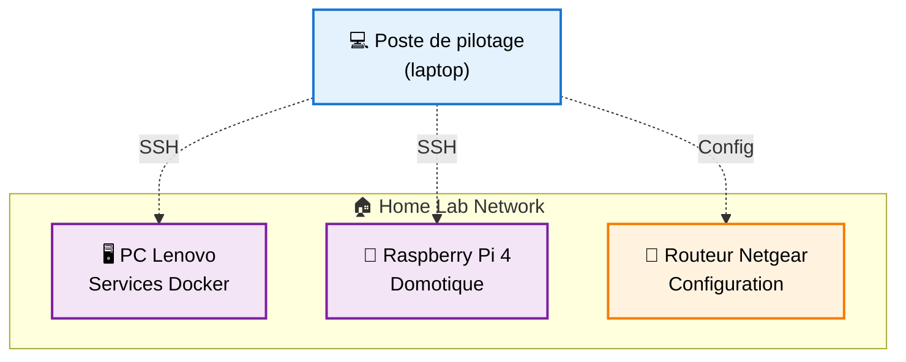
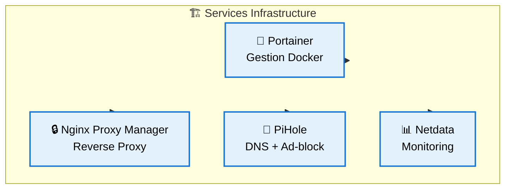
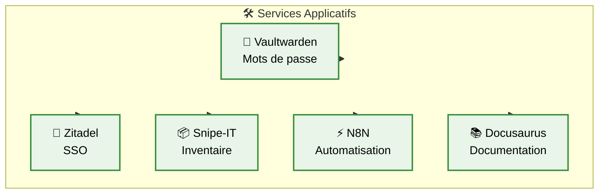
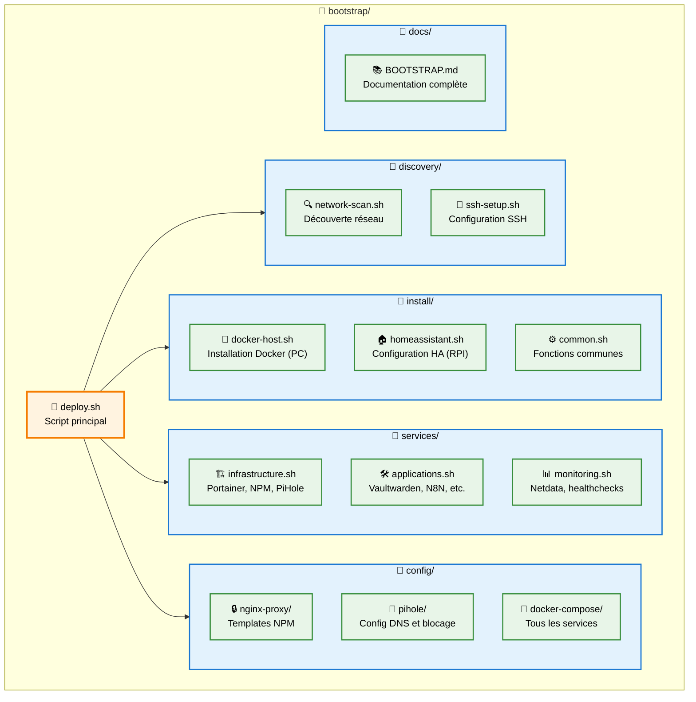

# Plan d'installation automatisée Home Lab from Scratch

## 🎯 **Objectif**
Installer et configurer complètement le home lab depuis un poste de pilotage via SSH, sans intervention manuelle sur les machines cibles.

## 🏗️ **Architecture cible**



## 📋 **Plan d'exécution**

### **Phase 1 : Préparatifs**
1. **Script de découverte réseau**
   - Scanner le réseau local pour détecter les machines
   - Identifier PC Lenovo et RPI par MAC/hostname
   - Vérifier la connectivité SSH

2. **Configuration initiale SSH**
   - Génération clés SSH si besoin
   - Déploiement des clés publiques
   - Test de connexion sans mot de passe

### **Phase 2 : Installation de base**
3. **PC Lenovo - Installation Docker Stack**
   - Détection OS (Ubuntu/Debian/etc.)
   - Installation Docker + Docker Compose
   - Configuration utilisateur docker
   - Création structure de dossiers

4. **Raspberry Pi - Préparation domotique**
   - Vérification Home Assistant OS ou installation
   - Configuration réseau et SSH
   - Préparatifs pour add-ons

### **Phase 3 : Déploiement services**
5. **Services infrastructure (PC Lenovo)**
   


6. **Services applicatifs (PC Lenovo)**



### **Phase 4 : Configuration automatique**
7. **Configuration Nginx Proxy Manager**
   - Création automatique des proxy hosts
   - Configuration SSL Let's Encrypt
   - Mapping des domaines `*.homelab.local`

8. **Configuration PiHole**
   - Listes de blocage par défaut
   - Configuration DNS upstream
   - Entrées DNS locales

9. **Configuration réseau**
   - DHCP avec IPs fixes pour serveurs
   - Configuration routeur (API si possible)

### **Phase 5 : Validation et monitoring**
10. **Tests de connectivité**
    - Vérification de tous les services
    - Tests des domaines SSL
    - Validation des automatisations

## 🛠️ **Structure des scripts proposés**



## ⚙️ **Paramètres de configuration**

**Fichier `config.yml`** :
```yaml
network:
  domain: "homelab.local"
  dns_server: "1.1.1.1"
  subnet: "192.168.1.0/24"

machines:
  docker_host:
    ip: "192.168.1.101"  
    hostname: "lenovo"
    mac: "XX:XX:XX:XX:XX:XX"  # À déterminer
    user: "homelab"
    services: ["portainer", "npm", "pihole", "vaultwarden", "n8n"]
  
  homeassistant:
    ip: "192.168.1.100"
    hostname: "rpi"
    mac: "XX:XX:XX:XX:XX:XX"  # À déterminer
    user: "homelab"
    services: ["hass", "zigbee2mqtt", "frigate"]

router:
  ip: "192.168.1.1"
  model: "netgear_r7100lg"
  management_interface: "web"  # ou "api" si disponible

services:
  portainer:
    port: 9000
    admin_user: "admin"
    admin_password: "[AUTO_GENERATED]"
    domain: "portainer.homelab.local"
  
  nginx_proxy:
    ports: [80, 443, 81]
    admin_email: "admin@homelab.local"
    domain: "npm.homelab.local"
    
  pihole:
    port: 80
    admin_password: "[AUTO_GENERATED]"
    domain: "pi.homelab.local"
    upstream_dns: ["1.1.1.1", "1.0.0.1"]
    blocklists:
      - "https://raw.githubusercontent.com/StevenBlack/hosts/master/hosts"
      - "https://someonewhocares.org/hosts/zero/hosts"

  vaultwarden:
    port: 80
    domain: "vault.homelab.local"
    admin_token: "[AUTO_GENERATED]"
    smtp_config: "brevo"

  zitadel:
    ports: [8080, 8443]
    domain: "auth.homelab.local"
    database: "postgres"

  snipe_it:
    port: 80  
    domain: "assets.homelab.local"
    database: "mysql"

  n8n:
    port: 5678
    domain: "n8n.homelab.local"
    auth_user: "admin"
    auth_password: "[AUTO_GENERATED]"

  netdata:
    port: 19999
    domain: "monitoring.homelab.local"

  docusaurus:
    port: 3000
    domain: "docs.homelab.local"
```

## 🔒 **Sécurité**

### **Authentification**
- **Clés SSH uniquement** (pas de passwords)
- **Mots de passe auto-générés** pour services (32 chars + symboles)
- **Stockage sécurisé** des credentials dans `~/.homelab/secrets/`

### **Réseau**
- **Services exposés** via reverse proxy uniquement
- **SSL obligatoire** pour tous les services web  
- **Firewall configuré** automatiquement (ufw)
- **Fail2ban** pour protection SSH

### **Données sensibles**
- **Chiffrement** des fichiers de configuration
- **Rotation** automatique des secrets
- **Audit trail** de toutes les modifications

## 📊 **Monitoring de l'installation**

### **Interface temps réel**
```
[1/10] Découverte réseau................... ✅ DONE
[2/10] Configuration SSH................... 🔄 IN PROGRESS  
[3/10] Installation Docker................. ⏳ PENDING
[4/10] Services infrastructure............. ⏳ PENDING
...
```

### **Logs détaillés**
- **Fichier de log** : `~/.homelab/logs/bootstrap-$(date +%Y%m%d-%H%M%S).log`
- **Niveaux** : DEBUG, INFO, WARN, ERROR
- **Rotation** automatique des logs

### **Rollback automatique**
- **Snapshots** avant chaque phase critique
- **Rollback** automatique en cas d'échec
- **Points de restauration** manuels

## 🎛️ **Interface utilisateur**

### **Modes d'exécution**
```bash
# Installation complète automatique
./bootstrap/deploy.sh --config config.yml --auto

# Installation interactive avec confirmations
./bootstrap/deploy.sh --interactive

# Installation avec dry-run (simulation)
./bootstrap/deploy.sh --dry-run

# Réinstallation d'un service spécifique
./bootstrap/deploy.sh --service nginx-proxy-manager --force

# Mise à jour des services existants
./bootstrap/deploy.sh --update-all

# Backup avant modifications
./bootstrap/deploy.sh --backup-first
```

### **Options avancées**
```bash
# Skip des étapes spécifiques
--skip-discovery --skip-ssh-setup

# Force l'installation même si des services existent
--force-overwrite

# Mode debug avec logs verbeux
--debug --verbose

# Configuration personnalisée
--config /path/to/custom-config.yml

# Déploiement sur un seul host
--target docker_host --target homeassistant
```

## 📋 **Prérequis**

### **Poste de pilotage**
- **OS** : Linux, macOS, WSL2
- **Logiciels** : bash, ssh, sshpass, nmap, curl, jq
- **Réseau** : Connectivité vers le réseau home lab

### **Machines cibles**
- **PC Lenovo** : OS Linux fraîchement installé, SSH activé
- **Raspberry Pi** : Raspberry Pi OS ou Home Assistant OS
- **Connectivité** : SSH accessible, utilisateur avec sudo

### **Réseau**
- **DHCP** : Routeur avec DHCP activé
- **Internet** : Connectivité pour téléchargements
- **DNS** : Domaine `homelab.local` configuré (optionnel pour début)

## 🚀 **Utilisation type**

### **Première installation**
1. **Préparation**
   ```bash
   git clone https://github.com/YOUR_USERNAME/home-lab.git
   cd home-lab/bootstrap
   cp config.yml.example config.yml
   # Éditer config.yml avec vos paramètres
   ```

2. **Découverte et test**
   ```bash
   ./deploy.sh --dry-run --verbose
   ```

3. **Installation complète**
   ```bash
   ./deploy.sh --config config.yml --auto
   ```

4. **Vérification**
   ```bash
   ./deploy.sh --test-all --show-urls
   ```

### **Maintenance**
```bash
# Mise à jour des services
./deploy.sh --update-all

# Ajout d'un nouveau service  
./deploy.sh --service octoprint --add

# Sauvegarde complète
./deploy.sh --backup-all --storage /backup/location
```

## ❓ **Questions pour affiner le plan**

### **Configuration réseau**
1. **IPs fixes** : Les adresses IP sont-elles déjà définies ou à découvrir ?
2. **MAC addresses** : Faut-il les détecter automatiquement ?
3. **Routeur** : API de gestion disponible ou configuration manuelle ?

### **Services prioritaires**
4. **Ordre d'installation** : Quel ordre de priorité pour les services ?
5. **Services optionnels** : Lesquels peuvent être skippés en première installation ?

### **Authentification** 
6. **SSH existant** : Clés SSH déjà configurées ou à générer ?
7. **Utilisateurs** : Même utilisateur sur toutes les machines ?

### **Domaine et SSL**
8. **DNS externe** : `homelab.local` déjà configuré avec DNS externe ?
9. **Certificats** : Let's Encrypt possible ou certificats auto-signés ?

### **Données existantes**
10. **Migration** : Faut-il prévoir la migration de données existantes ?
11. **Sauvegardes** : Configuration des sauvegardes dès l'installation ?

---

**Prochaines étapes** : Valider ce plan et ajuster selon tes besoins avant implémentation.