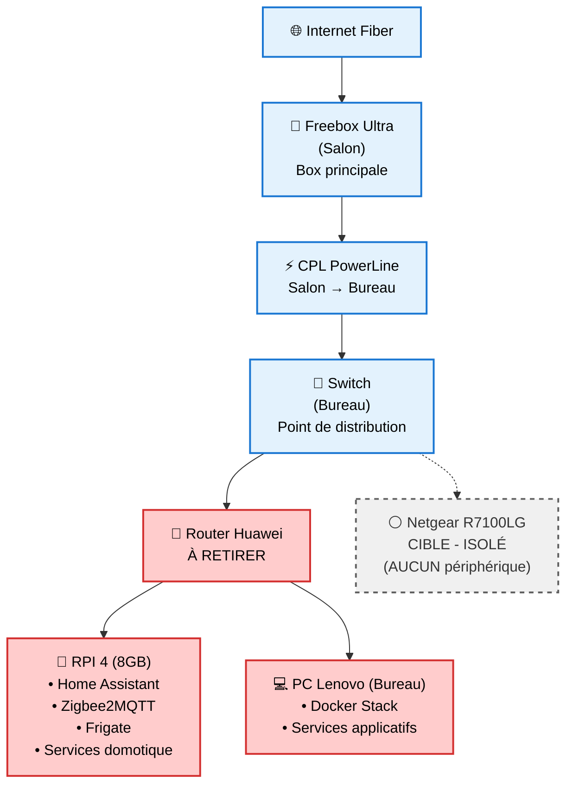
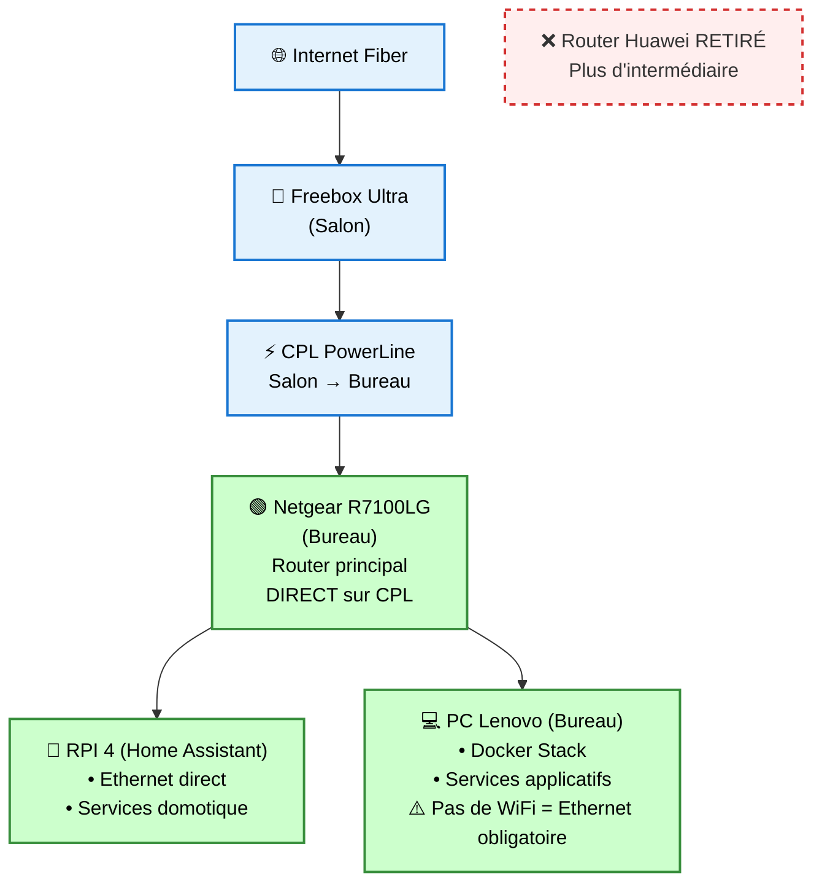

# Analyse du Setup Actuel - Home Lab

## 🎯 **Objectif**
Cartographier précisément l'infrastructure réseau actuelle avant toute migration pour éviter les interruptions de service.

## 🏠 **Topologie physique actuelle**

## 📊 **Configuration réseau actuelle**

### **Freebox Ultra (Salon)**
- **Rôle** : Passerelle Internet principale
- **Connexion** : Fibre optique
- **Services** : DHCP, NAT, WiFi principal
- **IP** : `192.168.1.1` (présumé)
- **Configuration** : Mode bridge ou routeur ?

### **Switch Bureau**
- **Rôle** : Point de distribution réseau
- **Connexion** : CPL depuis Freebox (Salon → Bureau)  
- **Périphériques connectés** :
  - Router Huawei (à retirer)
  - Netgear R7100LG (cible)

### **Router Huawei (Bureau) - À RETIRER**
- **Rôle** : Router principal actuel
- **Connexion** : Ethernet → Switch → CPL → Internet
- **Configuration** : Mode router ou AP ?
- **Périphériques connectés** :
  - Raspberry Pi 4 (Ethernet)
  - PC Lenovo (Ethernet - pas de WiFi)

### **Netgear R7100LG (Bureau) - CIBLE**  
- **Rôle futur** : Router principal bureau
- **État actuel** : Router isolé, connecté au switch mais inutilisé
- **Connexion actuelle** : Ethernet → Switch → CPL → Internet
- **Périphériques actuels** :
  - **AUCUN périphérique connecté**
  - **Aucun lien avec RPI ou PC Lenovo**
  - **Router complètement séparé du setup actuel**

### **Raspberry Pi 4 - Home Assistant**
- **Connexion actuelle** : Ethernet → Router Huawei
- **Connexion cible** : Ethernet → Netgear R7100LG
- **Services critiques** :
  - Home Assistant Core
  - Zigbee2MQTT (coordinateur USB)
  - Frigate (caméras IP)
  - Mosquitto MQTT
  - Add-ons HA

### **PC Lenovo - Docker Host**
- **Connexion actuelle** : Ethernet → Router Huawei → Switch → CPL → Internet
- **Connexion cible** : Ethernet → Netgear R7100LG → Switch → CPL → Internet
- **Limitation** : Pas de WiFi intégré (obligé d'être connecté par câble)
- **État actuel** : ✅ Services Docker fonctionnels avec Internet
- **Services Docker** :
  - Portainer, Netdata
  - Nginx Proxy Manager (avec certificats SSL Let's Encrypt)
  - Vaultwarden, Zitadel
  - Snipe-IT, OctoPrint  
  - PiHole (fonctionnel avec accès Internet)

## ⚠️ **Points critiques identifiés**

### **Connectivité réseau**
1. **Concentration sur Huawei** : RPI et PC Lenovo tous deux connectés au router Huawei
2. **Point de défaillance unique** : Tous les services critiques dépendent du router Huawei
3. **Netgear complètement isolé** : Router cible connecté au switch mais AUCUN lien avec les machines actuelles
4. **Dépendance CPL critique** : Connectivité Internet via CPL→Switch→Huawei
5. **Setup binaire** : Soit tout sur Huawei (actuel), soit tout sur Netgear (cible)

### **Services critiques**
1. **Home Assistant** : Hub domotique central
   - Périphériques Zigbee connectés
   - Automatisations actives
   - Caméras de sécurité
   
2. **Services Docker** : Applications de production
   - Vaultwarden (mots de passe)
   - Nginx Proxy Manager (accès web)
   - PiHole (résolution DNS)

### **Domaines et certificats SSL**
- **Domaine** : `homelab.example`
- **Certificats** : Let's Encrypt via NPM
- **Résolution DNS** : PiHole local + domaines externes

## 🎯 **Architecture cible souhaitée**

## 📋 **Plan de migration sécurisé**

### **Phase 1 : Préparation (Sans impact)**
1. **Audit complet** de la configuration actuelle
   - IPs fixes configurées
   - Ports forwarding actifs
   - Certificats SSL en cours
   - Services Docker running

2. **Sauvegarde complète**
   - Configuration Home Assistant
   - Volumes Docker
   - Configuration réseau
   - Certificats SSL

3. **Documentation détaillée**
   - Liste des périphériques et MACs
   - Configuration DHCP actuelle
   - Règles firewall
   - Automatisations HA critiques

### **Phase 2 : Tests en parallèle**
1. **Configuration Netgear en parallèle**
   - Même plage IP que setup actuel
   - DHCP désactivé temporairement
   - Tests de connectivité

2. **Tests de services**
   - Connectivité PC Lenovo via CPL
   - Accès Internet et DNS
   - Performance réseau

### **Phase 3 : Migration contrôlée**
1. **Fenêtre de maintenance planifiée**
   - Arrêt propre des services critiques
   - Notification aux utilisateurs
   - Rollback plan préparé

2. **Basculement réseau**
   - Connexion RPI sur Netgear
   - Reconfiguration IP si nécessaire
   - Redémarrage services

3. **Validation post-migration**
   - Tests de tous les services
   - Vérification automatisations HA
   - Tests accès externe (domaines)

### **Phase 4 : Retrait Huawei**
1. **Période d'observation** (24-48h)
2. **Retrait physique** du router Huawei
3. **Nettoyage configuration** réseau

## ❓ **Questions cruciales à clarifier**

### **Configuration réseau actuelle**
1. **Freebox Ultra** :
   - En mode bridge ou routeur ?
   - Plage IP DHCP configurée ?
   - Port forwarding actuel ?

2. **Router Huawei** :
   - Mode router ou point d'accès ?
   - DHCP actif ou passthrough ?
   - IPs fixes configurées ?

3. **Netgear R7100LG** :
   - Actuellement configuré comment ?
   - En cascade ou mode AP ?
   - Firmware à jour ?

### **Services critiques**
4. **Home Assistant** :
   - IP fixe configurée où ?
   - Domaines pointent vers quelle IP ?
   - Périphériques Zigbee critiques ?

5. **Docker services** :
   - Volumes sur quel stockage ?
   - Réseau Docker personnalisé ?
   - Dépendances inter-services ?

### **Connectivité externe**
6. **Domaine homelab.example** :
   - DNS externe configuré comment ?
   - Certificats wildcard ou individuels ?
   - Renouvellement automatique actif ?

## 🔒 **Stratégie de sécurisation**

### **Avant toute modification**
- ✅ **Backup complet** de toutes les configurations
- ✅ **Documentation** de l'état actuel
- ✅ **Plan de rollback** détaillé
- ✅ **Fenêtre de maintenance** planifiée

### **Pendant la migration**
- ✅ **Migration par étapes** avec validation
- ✅ **Rollback immédiat** si problème critique
- ✅ **Monitoring continu** des services
- ✅ **Communication** aux utilisateurs

### **Après migration**
- ✅ **Période d'observation** 48h minimum  
- ✅ **Tests complets** de tous les services
- ✅ **Validation** des automatisations
- ✅ **Documentation** du nouvel état

---

## 🎯 **Prochaines étapes recommandées**

1. **Validation de cette analyse** avec toi
2. **Audit détaillé** de la configuration actuelle  
3. **Scripts de sauvegarde** automatisés
4. **Plan de migration** step-by-step
5. **Tests en environnement isolé** si possible

**⚠️ AUCUNE MODIFICATION** ne sera effectuée sans validation explicite de chaque étape.