# Documentation Docusaurus - Home Lab

Cette documentation est générée avec [Docusaurus](https://docusaurus.io/) et peut être déployée sur votre infrastructure Docker.

## Développement local

### Installation des dépendances
```bash
cd docs
npm install
```

### Démarrage en mode développement
```bash
npm start
```

La documentation sera accessible sur `http://localhost:3000` avec hot reload.

## Build de production

### Build local
```bash
npm run build
npm run serve  # Test du build local
```

### Docker

#### Build et démarrage rapide
```bash
cd docker-compose/docs
docker-compose up -d
```

La documentation sera accessible sur `http://localhost:3000`.

#### Développement avec Docker
```bash
cd docker-compose/docs
docker-compose --profile dev up -d docs-dev
```

Mode développement avec hot reload sur `http://localhost:3001`.

## Déploiement sur le home lab

### Avec Nginx Proxy Manager

1. **Démarrer le service**
   ```bash
   cd docker-compose/docs
   docker-compose up -d
   ```

2. **Configurer NPM**
   - Domain: `docs.yolo.yt`
   - Forward Hostname/IP: `home-lab-docs`
   - Forward Port: `80`
   - SSL: Activé avec Let's Encrypt

### Intégration dans l'installation principale

Le service documentation peut être ajouté au script d'installation principal :

```bash
# Dans install.sh, ajouter
start_documentation() {
    log "Démarrage de la documentation..."
    cd "$INSTALL_DIR/docker-compose/docs"
    $DOCKER_COMPOSE_CMD up -d docs
}
```

## Structure de la documentation

```mermaid
graph TB
    subgraph DocusaurusProject["📁 docs/"]
        subgraph MainDocs["📁 docs/ - Documentation principale"]
            Intro["📄 intro.md<br/>Page d'accueil"]
            Architecture["🏗️ ARCHITECTURE.md<br/>Architecture du home lab"]
            Services["🛠️ SERVICES.md<br/>Services déployés"]
            Network["🌐 NETWORK.md<br/>Configuration réseau"]
            Workflows["⚡ WORKFLOWS.md<br/>Workflows N8N"]
            Installation["📦 INSTALLATION.md<br/>Guide d'installation"]
            QuickInstall["🚀 QUICK_INSTALL.md<br/>Installation rapide"]
            NetworkTopology["🗺️ architecture/network-topology.md<br/>Diagrammes réseau"]
        end
        
        subgraph Blog["📁 blog/"]
            BlogContent["📝 Blog<br/>Changelog, mises à jour"]
        end
        
        subgraph Static["📁 static/"]
            Assets["🖼️ Assets statiques<br/>Images, CSS, JS"]
        end
        
        Config["⚙️ docusaurus.config.ts<br/>Configuration Docusaurus"]
        Sidebars["🗂️ sidebars.ts<br/>Navigation"]
    end
    
    classDef folder fill:#e3f2fd,stroke:#1976d2,stroke-width:2px,color:#000
    classDef file fill:#e8f5e8,stroke:#388e3c,stroke-width:2px,color:#000
    classDef config fill:#fff3e0,stroke:#f57c00,stroke-width:2px,color:#000
    
    class MainDocs,Blog,Static folder
    class Intro,Architecture,Services,Network,Workflows,Installation,QuickInstall,NetworkTopology,BlogContent,Assets file
    class Config,Sidebars config
```



## Personnalisation

### Thème et couleurs
Éditez `src/css/custom.css` pour personnaliser l'apparence.

### Navigation
Modifiez `sidebars.ts` pour organiser la navigation.

### Configuration
Adaptez `docusaurus.config.ts` pour :
- URL de production
- Métadonnées
- Plugins additionnels
- Intégrations (analytics, search)

## Maintenance

### Mise à jour de Docusaurus
```bash
npm update @docusaurus/core @docusaurus/preset-classic
```

### Mise à jour de la documentation
1. Modifiez les fichiers `.md` dans `docs/`
2. Testez localement avec `npm start`
3. Commitez et rebuilder l'image Docker

### Monitoring
Le service inclut un health check automatique via wget.

## Commandes utiles

```bash
# Développement
npm start                   # Dev server avec hot reload
npm run build              # Build de production
npm run serve              # Servir le build localement

# Docker
docker-compose up -d                    # Production
docker-compose --profile dev up -d      # Développement
docker-compose logs -f docs             # Logs
docker-compose restart docs             # Redémarrage

# Maintenance
docker-compose pull         # Mise à jour images
docker-compose down -v      # Arrêt avec suppression volumes
```

## Troubleshooting

### Build échoue
- Vérifiez la syntaxe Markdown
- Liens cassés dans les documents
- Images manquantes dans `static/`

### Container ne démarre pas
- Port 3000 déjà utilisé : modifier dans docker-compose.yml
- Permissions : `sudo chown -R $USER:$USER docs/`
- Logs : `docker-compose logs docs`

### Performance lente
- Optimisez les images dans `static/`
- Réduisez le nombre de plugins
- Utilisez la configuration nginx fournie