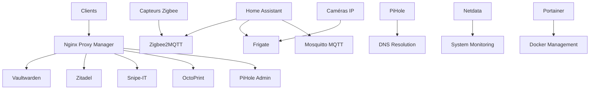

# Inventaire des Services - Home Lab Yohikofox

## PC Lenovo - Stack Docker

### Gestion et Infrastructure

#### Portainer
- **Image** : `portainer/portainer-ce`
- **Port** : `9000`
- **URL** : `http://lenovo-ip:9000`
- **Description** : Interface web pour gérer tous les containers Docker
- **Volumes** :
  - `/var/run/docker.sock:/var/run/docker.sock`
  - `portainer_data:/data`
- **Utilisation** :
  - Déploiement de nouveaux services
  - Monitoring des containers
  - Gestion des volumes et réseaux
  - Logs centralisés des applications

#### Netdata
- **Image** : `netdata/netdata`
- **Port** : `19999`
- **URL** : `http://lenovo-ip:19999`
- **Description** : Monitoring temps réel des performances système
- **Volumes** :
  - `/proc:/host/proc:ro`
  - `/sys:/host/sys:ro`
  - `/var/run/docker.sock:/var/run/docker.sock:ro`
- **Métriques surveillées** :
  - CPU, RAM, disques, réseau
  - Containers Docker
  - Services système
- **Alertes** : Seuils configurables pour notifications

#### Nginx Proxy Manager
- **Image** : `jc21/nginx-proxy-manager`
- **Ports** : `80` (HTTP), `443` (HTTPS), `81` (Admin)
- **URL Admin** : `http://lenovo-ip:81`
- **Description** : Reverse proxy avec gestion SSL automatique
- **Fonctionnalités** :
  - Certificats SSL Let's Encrypt automatiques
  - Proxy vers services internes
  - Protection par mot de passe
  - Logs d'accès détaillés
- **Configuration** :
  - Domaines `*.yolo.yt` pointés vers services
  - Renouvellement automatique certificats
  - Redirection HTTP → HTTPS

### Services Applicatifs

#### Vaultwarden
- **Image** : `vaultwarden/server`
- **URL** : `https://vault.yolo.yt`
- **Description** : Serveur Bitwarden compatible, gestionnaire de mots de passe
- **Base de données** : SQLite (`/data/db.sqlite3`)
- **Fonctionnalités** :
  - Synchronisation multi-appareils
  - Partage sécurisé de mots de passe
  - Générateur de mots de passe
  - 2FA et authentification avancée
- **Configuration SMTP** :
  - Serveur : Brevo (`smtp-relay.brevo.com:587`)
  - Notifications et invitations par email
- **Sauvegardes** : SQLite + volumes (automatisation N8N prévue)

#### Zitadel
- **Image** : `ghcr.io/zitadel/zitadel`
- **URL** : `https://auth.yolo.yt`
- **Description** : Gestionnaire d'identité et SSO (Single Sign-On)
- **Base de données** : PostgreSQL ou CockroachDB
- **Fonctionnalités** :
  - Authentification centralisée
  - OAuth2/OIDC provider
  - Gestion des utilisateurs et rôles
  - MFA (Multi-Factor Authentication)
- **Intégrations** : Services supportant OIDC
- **Use cases** :
  - SSO pour services internes
  - API authentication
  - Gestion des accès centralisée

#### Snipe-IT
- **Image** : `snipe/snipe-it`
- **URL** : `https://assets.yolo.yt`
- **Description** : Système de gestion d'inventaire IT
- **Base de données** : MySQL/MariaDB
- **Fonctionnalités** :
  - Inventaire matériel informatique
  - Suivi des licences logicielles
  - Check-in/check-out d'équipements
  - Rapports et statistiques
- **Gestion** :
  - Ordinateurs, serveurs, périphériques
  - Garanties et contrats de maintenance
  - Historique des mouvements

#### OctoPrint
- **Image** : `octoprint/octoprint`
- **URL** : `https://print.yolo.yt`
- **Description** : Interface de contrôle pour imprimante 3D
- **Périphériques** : Connexion USB vers imprimante 3D
- **Fonctionnalités** :
  - Upload et gestion des fichiers G-code
  - Contrôle à distance de l'impression
  - Webcam pour surveillance
  - Plugins pour fonctionnalités avancées
- **Plugins populaires** :
  - OctoLapse (timelapse)
  - Bed Level Visualizer
  - Filament Manager

### Services Réseau

#### PiHole
- **Image** : `pihole/pihole`
- **Ports** : `53` (DNS), `67` (DHCP), `80` (Web)
- **URL** : `https://pi.yolo.yt/admin`
- **Description** : Serveur DNS avec blocage de publicités
- **Fonctionnalités** :
  - Blocage DNS des domaines publicitaires
  - Statistiques de requêtes DNS
  - Listes de blocage personnalisées
  - Interface d'administration web
- **Configuration** :
  - Upstream DNS : Cloudflare/Quad9
  - DHCP local (si activé)
  - Logs des requêtes pour debugging

## Raspberry Pi 4 - Home Assistant OS

### Système Principal

#### Home Assistant Core
- **Version** : Home Assistant OS
- **URL** : `http://rpi-ip:8123`
- **Description** : Hub domotique central
- **Fonctionnalités principales** :
  - Interface utilisateur unifiée
  - automatisations et scripts
  - Intégrations avec services cloud
  - Application mobile companion
- **Stockage** :
  - Base de données : SQLite/PostgreSQL
  - Enregistrements historiques
  - Configuration YAML

#### Supervisor
- **Description** : Gestionnaire des add-ons Home Assistant
- **Fonctionnalités** :
  - Installation/mise à jour des add-ons
  - Snapshots complets du système
  - Gestion des sauvegardes
  - Monitoring des add-ons

### Add-ons Installés

#### Zigbee2MQTT
- **Port** : `8080` (Web UI)
- **Description** : Passerelle Zigbee vers MQTT
- **Matériel** : Dongle Zigbee USB
- **Fonctionnalités** :
  - Pairing/découverte périphériques Zigbee
  - Interface web pour gestion réseau mesh
  - Mise à jour OTA des périphériques
  - Topologie réseau visuelle
- **Périphériques supportés** :
  - Capteurs (température, humidité, mouvement)
  - Actionneurs (prises, ampoules, volets)
  - Détecteurs (fumée, inondation, vibration)

#### Frigate
- **Ports** : `5000` (Web), `1935` (RTMP)
- **Description** : Analyse vidéo en temps réel avec IA
- **Matériel requis** : Coral USB Accelerator (recommandé)
- **Fonctionnalités** :
  - Détection d'objets (personnes, véhicules, animaux)
  - Enregistrement déclenché par événements
  - Interface web pour review des clips
  - Intégration native Home Assistant
- **Caméras supportées** :
  - Flux RTSP/RTMP
  - Caméras IP standard
  - Intégration avec notifications HA

#### Mosquitto MQTT Broker
- **Port** : `1883` (MQTT), `8883` (MQTT SSL)
- **Description** : Broker MQTT pour communication IoT
- **Utilisation** :
  - Communication Zigbee2MQTT ↔ Home Assistant
  - Capteurs DIY (ESP32/ESP8266)
  - Scripts et automatisations
  - Intégration services tiers

#### File Editor
- **Description** : Éditeur de fichiers intégré
- **Fonctionnalités** :
  - Édition configuration YAML
  - Explorateur de fichiers
  - Syntaxe highlighting
  - Sauvegarde avec validation

#### Terminal & SSH
- **Port** : `22` (SSH)
- **Description** : Accès shell au système Home Assistant OS
- **Utilisation** :
  - Debugging avancé
  - Accès aux logs système
  - Installation de packages personnalisés
  - Maintenance système

### Périphériques Connectés

#### Réseau Zigbee
- **Coordinateur** : Dongle USB Zigbee (CC2531/ConBee II/Sonoff)
- **Topologie** : Réseau mesh auto-organisé
- **Périphériques types** :
  - Capteurs de température/humidité
  - Détecteurs de mouvement PIR
  - Prises connectées
  - Ampoules intelligentes
  - Capteurs d'ouverture porte/fenêtre

#### Caméras IP
- **Connexion** : Réseau local via RTSP/ONVIF
- **Emplacements** : Entrées, salon, extérieur
- **Fonctionnalités** :
  - Streaming temps réel
  - Enregistrement sur détection
  - Vision nocturne infrarouge
  - Notifications push sur événements

## Réseau et Interconnexions

### Communication Inter-Services

### Flux de données principaux

1. **Web → Services** : NPM reverse proxy avec SSL
2. **Domotique** : Zigbee → Z2M → MQTT → HA
3. **Vidéosurveillance** : Caméras → Frigate → HA → Notifications
4. **DNS** : Tous services → PiHole → Internet
5. **Monitoring** : Netdata → Métriques système temps réel
6. **Management** : Portainer → Gestion containers Docker

### Ports réseau utilisés

| Service | Port(s) | Protocole | Accès |
|---------|---------|-----------|-------|
| Nginx Proxy Manager | 80, 443, 81 | HTTP/HTTPS | Public |
| Home Assistant | 8123 | HTTP | Local |
| Portainer | 9000 | HTTP | Local |
| Netdata | 19999 | HTTP | Local |
| PiHole | 53, 80 | DNS/HTTP | Local |
| Zigbee2MQTT | 8080 | HTTP | Local |
| Frigate | 5000 | HTTP | Local |
| Mosquitto MQTT | 1883, 8883 | MQTT | Local |

## Maintenance et Monitoring

### Logs centralisés
- **Docker** : `docker logs <container>`
- **Home Assistant** : Interface web + `/config/home-assistant.log`
- **System** : `journalctl` sur chaque machine

### Sauvegardes actuelles
- **Home Assistant** : Snapshots automatiques
- **Docker volumes** : Manuelles via Portainer
- **Configurations** : Git (recommandé)

### Mises à jour
- **Home Assistant OS** : Interface Supervisor
- **Docker images** : Watchtower ou manuel via Portainer
- **Add-ons HA** : Interface Supervisor

Cette infrastructure offre une base solide pour un home lab moderne avec séparation des responsabilités et facilité de maintenance.