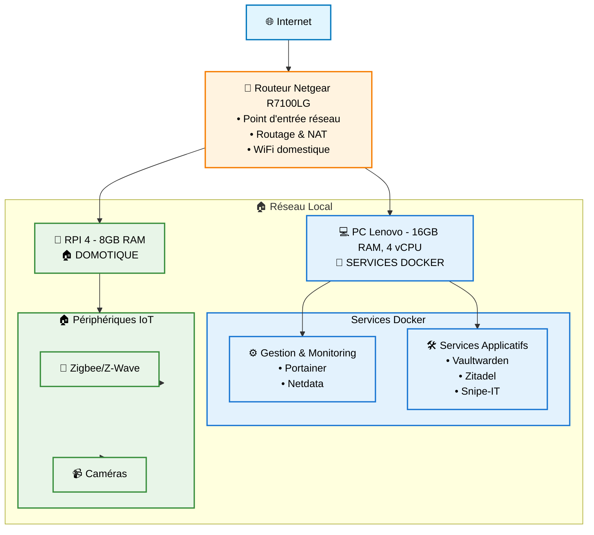
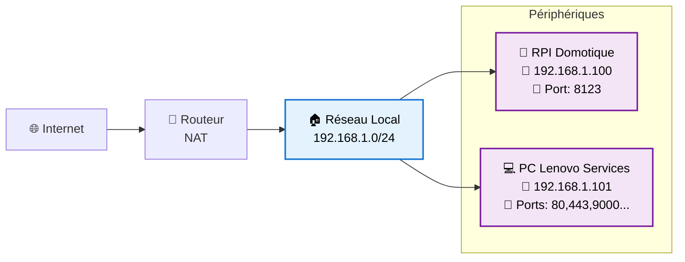

# Architecture du Home Lab Yohikofox

## Vue d'ensemble

Le home lab Yohikofox est structuré autour de 4 composants principaux répartis selon leur fonction et leurs capacités matérielles. L'architecture privilégie la séparation des préoccupations avec la domotique isolée sur le Raspberry Pi et les services applicatifs sur le PC Lenovo.

## Schéma d'architecture

## Infrastructure matérielle

### Routeur Principal
**Netgear R7100LG**
- **Rôle** : Passerelle Internet et routeur principal
- **Fonctions** :
  - Routage et NAT vers Internet
  - Réseau WiFi domestique
  - DHCP (probablement)
  - Port forwarding vers services internes

### Serveur Principal - PC Lenovo
**Spécifications** :
- **RAM** : 16 GB
- **CPU** : 4 vCPU
- **OS** : Linux (présumé)
- **Rôle** : Serveur d'applications containerisées

**Capacités** :
- Hébergement des services Docker
- Gestion de l'infrastructure applicative
- Services réseau avancés
- Stockage et sauvegarde

### Serveur Domotique - Raspberry Pi 4
**Spécifications** :
- **RAM** : 8 GB
- **OS** : Home Assistant Operating System
- **Rôle** : Hub domotique central

**Capacités** :
- Gestion des périphériques IoT
- Protocoles domotique (Zigbee, Z-Wave)
- Traitement vidéo (Frigate)
- Automatisations domestiques

### Clients
- **Laptops** : Accès admin et utilisation quotidienne
- **Tablets** : Interfaces domotique et monitoring
- **Smartphones** : Applications mobiles et notifications

## Répartition des services

### PC Lenovo - Stack Docker

#### Gestion & Infrastructure
| Service                 | Port   | Description                   | Usage                         |
|-------------------------|--------|-------------------------------|-------------------------------|
| **Portainer**           | 9000   | Interface de gestion Docker   | Administration containers     |
| **Netdata**             | 19999  | Monitoring système temps réel | Surveillance performance      |
| **Nginx Proxy Manager** | 80/443 | Reverse proxy + SSL           | Exposition sécurisée services |

#### Services Applicatifs
| Service         | Domaine        | Description                   | Usage                        |
|-----------------|----------------|-------------------------------|------------------------------|
| **Vaultwarden** | vault.yolo.yt  | Gestionnaire de mots de passe | Coffre-fort personnel        |
| **Zitadel**     | auth.yolo.yt   | Gestionnaire d'identité/SSO   | Authentification centralisée |
| **Snipe-IT**    | assets.yolo.yt | Gestion d'inventaire IT       | Suivi équipements            |
| **OctoPrint**   | print.yolo.yt  | Gestion imprimante 3D         | Impression 3D à distance     |

#### Services Réseau
| Service    | Domaine    | Description       | Usage           |
|------------|------------|-------------------|-----------------|
| **PiHole** | pi.yolo.yt | DNS + Blocage pub | Filtrage réseau |

### Raspberry Pi 4 - Home Assistant OS

#### Core Domotique
| Service            | Description                 | Usage                        |
|--------------------|-----------------------------|------------------------------|
| **Home Assistant** | Hub domotique principal     | Automatisations et interface |
| **Zigbee2MQTT**    | Passerelle protocole Zigbee | Capteurs et actionneurs      |
| **Frigate**        | Analyse vidéo IA            | Surveillance et détection    |

#### Add-ons Home Assistant
- **File Editor** : Édition configuration
- **Terminal & SSH** : Accès shell distant  
- **Mosquitto MQTT** : Broker messages IoT
- **Node-RED** : Automatisations avancées (si installé)
- **InfluxDB + Grafana** : Métriques historiques (si installé)

## Architecture réseau

### Segmentation logique

### Flux de données principaux

1. **Internet → Services** : Via Nginx Proxy Manager
2. **Clients → Home Assistant** : Interface domotique (port 8123)  
3. **Capteurs → MQTT → HA** : Données IoT via Zigbee2MQTT
4. **Caméras → Frigate → HA** : Flux vidéo et détections
5. **Services Docker ↔ PiHole** : Résolution DNS filtrée

### Domaines et certificats

**Configuration DNS** :
- **PiHole** : Résolution locale + blocage publicitaire
- **Nginx Proxy Manager** : Reverse proxy avec SSL Let's Encrypt
- **Domaine principal** : `yolo.yt`

**Sous-domaines exposés** :
- `vault.yolo.yt` → Vaultwarden
- `auth.yolo.yt` → Zitadel  
- `assets.yolo.yt` → Snipe-IT
- `print.yolo.yt` → OctoPrint
- `pi.yolo.yt` → PiHole admin

## Sécurité et accès

### Authentification
- **Zitadel** : SSO centralisé pour services compatibles
- **Nginx Proxy Manager** : Terminaison SSL et protection
- **Home Assistant** : Authentification locale + API tokens

### Réseau
- **Firewall** : Au niveau routeur (NAT + règles)
- **SSL/TLS** : Certificats Let's Encrypt via NPM
- **VPN** : Accès distant sécurisé (à confirmer)

### Sauvegardes
- **Vaultwarden** : Sauvegarde SQLite (via N8N prévu)
- **Home Assistant** : Snapshots automatiques
- **Configurations** : Git pour Infrastructure as Code

## Points forts de l'architecture

✅ **Séparation des préoccupations** : Domotique isolée du reste  
✅ **Haute disponibilité** : Services critiques répartis  
✅ **Sécurité** : SSL partout + authentification centralisée  
✅ **Monitoring** : Netdata + possibles métriques HA  
✅ **Évolutivité** : Containerisation Docker facilitant les mises à jour  

## Points d'amélioration potentiels

🔄 **Sauvegarde centralisée** : Stratégie globale (en cours avec N8N)  
🔄 **Monitoring unifié** : Dashboard global des services  
🔄 **Réplication** : Services critiques sur les deux machines  
🔄 **Réseau avancé** : VLANs pour isolation renforcée  

## Dépendances critiques

### Services interdépendants
- **Nginx Proxy Manager** ← Tous les services web
- **PiHole** ← Résolution DNS pour domaines locaux
- **Zitadel** ← Services utilisant le SSO
- **Home Assistant** ← Tous les périphériques domotique

### Points de défaillance unique
- **Routeur** : Panne = perte Internet et réseau local
- **PC Lenovo** : Panne = perte services applicatifs
- **RPI** : Panne = perte domotique complète

Cette architecture offre un excellent équilibre entre fonctionnalités, performance et maintenabilité pour un home lab personnel.
