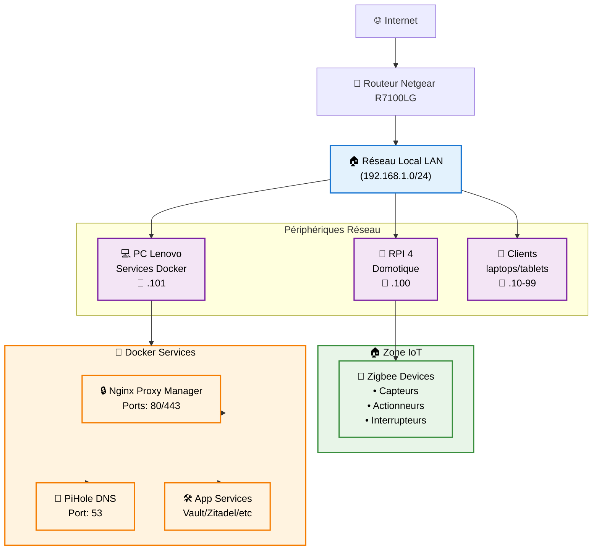
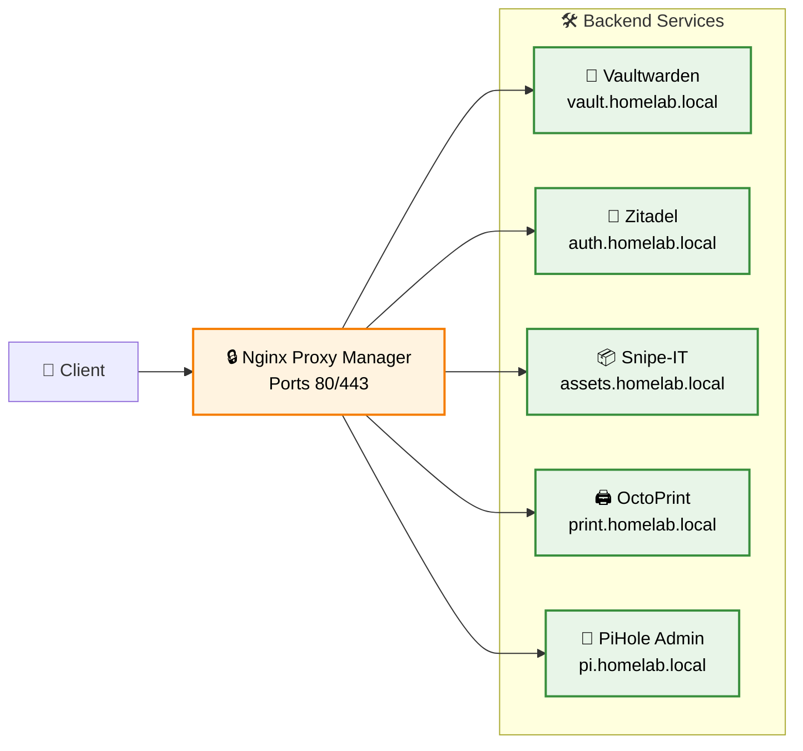
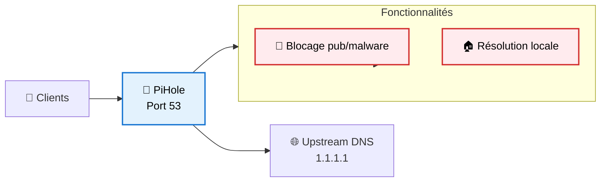
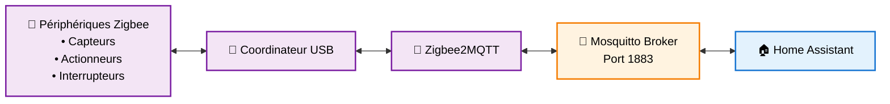
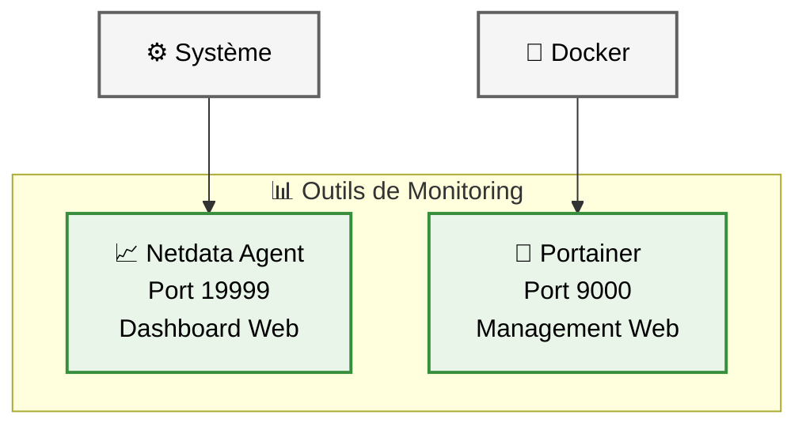
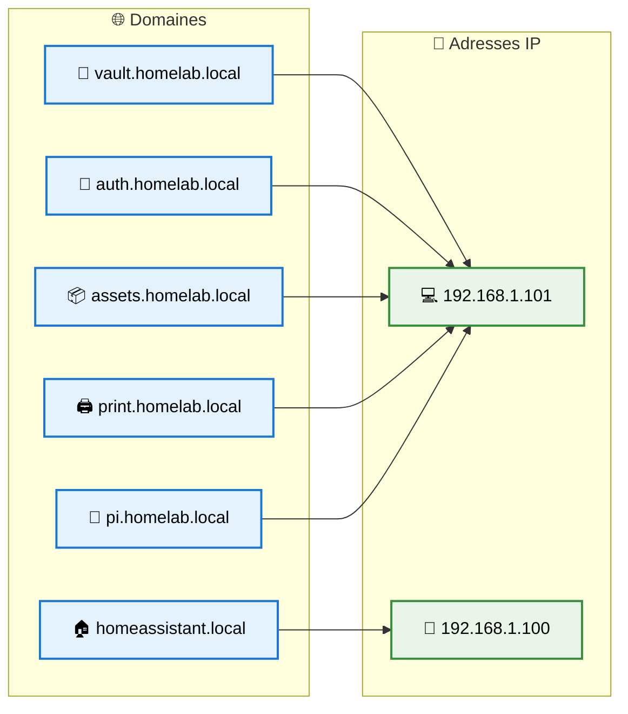

# Architecture Réseau - Home Lab Yohikofox

## Topologie réseau



## Plan d'adressage IP

### Plages IP par fonction

| Plage | Usage | Exemples |
|-------|-------|----------|
| `192.168.1.1` | Routeur/Passerelle | Netgear R7100LG |
| `192.168.1.10-99` | Clients dynamiques | Laptops, tablets, phones |
| `192.168.1.100` | Raspberry Pi 4 | Home Assistant |
| `192.168.1.101` | PC Lenovo | Services Docker |
| `192.168.1.102-110` | Serveurs fixes (réservé) | Expansion future |
| `192.168.1.200-254` | IoT/Périphériques | Caméras IP, imprimantes |

### Configuration réseau détaillée

#### Routeur Netgear R7100LG
- **IP** : `192.168.1.1`
- **Masque** : `255.255.255.0` (/24)
- **DHCP** : `192.168.1.10` → `192.168.1.99`
- **DNS primaire** : `192.168.1.101` (PiHole)
- **DNS secondaire** : `1.1.1.1` (Cloudflare)

#### Raspberry Pi 4 - Domotique
- **IP fixe** : `192.168.1.100`
- **Hostname** : `homeassistant.local`
- **Services exposés** :
  - `8123/tcp` : Home Assistant Web UI
  - `8080/tcp` : Zigbee2MQTT Web UI
  - `5000/tcp` : Frigate Web UI
  - `1883/tcp` : Mosquitto MQTT
  - `22/tcp` : SSH

#### PC Lenovo - Services Docker
- **IP fixe** : `192.168.1.101`
- **Hostname** : `docker-host.local`
- **Services exposés** :
  - `80/tcp` : HTTP → NPM
  - `443/tcp` : HTTPS → NPM  
  - `81/tcp` : NPM Admin
  - `9000/tcp` : Portainer
  - `19999/tcp` : Netdata
  - `53/tcp` : PiHole DNS

## Flux réseau par protocole

### HTTP/HTTPS (Web)



### DNS



### IoT/Domotique



### Monitoring



## Configuration DNS

### PiHole comme DNS primaire

#### Résolution locale



#### Upstream DNS
- **Primaire** : `1.1.1.1` (Cloudflare)
- **Secondaire** : `1.0.0.1` (Cloudflare backup)
- **Alternative** : `9.9.9.9` (Quad9)

#### Listes de blocage
- **Par défaut** : StevenBlack's hosts
- **Malware** : Malware Domain List
- **Publicité** : EasyList
- **Tracking** : EasyPrivacy

### Configuration SSL/TLS

#### Let's Encrypt via Nginx Proxy Manager
```
Internet → [Nginx Proxy Manager] → SSL Termination → Backend HTTP
            │
            ├─ Certificat wildcard *.yolo.yt
            ├─ Renouvellement automatique
            └─ Redirection HTTP → HTTPS forcée
```

## Sécurité réseau

### Firewall au niveau routeur

#### Port Forwarding (NAT)
```
Port 80 (HTTP)  → 192.168.1.101:80
Port 443 (HTTPS) → 192.168.1.101:443
Port 22 (SSH)   → Désactivé par défaut
```

#### Règles de sécurité
- **SSH** : Accès local uniquement
- **Services web** : Via reverse proxy seulement
- **IoT** : Pas d'accès Internet direct
- **Management** : Réseau local seulement

### Isolation des services

#### Réseaux Docker
```
services_network: Services applicatifs
proxy_network:   Nginx Proxy Manager
monitoring_network: Netdata, Portainer
```

#### Segmentation logique
- **Production** : Services exposés sur Internet
- **Management** : Outils d'administration (local)
- **IoT** : Périphériques domotique (isolé)
- **Monitoring** : Surveillance système (local)

## Redondance et haute disponibilité

### Points de défaillance unique

#### Critique
- **Routeur** : Panne = perte connectivité complète
- **PiHole DNS** : Panne = lenteur résolution DNS
- **NPM** : Panne = services web inaccessibles

#### Solutions de contournement
```
DNS Backup:     Configuration routeur avec DNS externe
Proxy Backup:   Accès direct par IP:Port en local
Monitoring:     Multiple sources (Netdata + HA)
```

### Stratégie de sauvegarde réseau

#### Configuration routeur
- Export configuration automatique
- Sauvegarde paramètres WiFi
- Liste des réservations DHCP

#### Configuration PiHole  
- Export listes de blocage personnalisées
- Sauvegarde configuration DNS
- Logs de requêtes (optionnel)

## Performance et optimisation

### Bande passante par service

| Service | Upload | Download | Critique |
|---------|--------|----------|----------|
| Vaultwarden | Faible | Faible | Haute |
| Home Assistant | Moyenne | Moyenne | Haute |
| Frigate | Élevée | Élevée | Moyenne |
| Netdata | Faible | Moyenne | Faible |
| OctoPrint | Moyenne | Faible | Moyenne |

### QoS recommandée
```
Priorité 1: SSH, DNS, HTTPS management
Priorité 2: Home Assistant, Vaultwarden  
Priorité 3: Streaming vidéo (Frigate)
Priorité 4: Monitoring, logs
```

## Surveillance réseau

### Métriques importantes

#### Disponibilité services
```bash
# Health check automatique
curl -f https://vault.yolo.yt/alive
curl -f http://192.168.1.100:8123/api/
curl -f http://192.168.1.101:9000/api/version
```

#### Performance réseau
- **Latence** : Ping entre machines
- **Bande passante** : Test iperf local  
- **DNS** : Temps résolution PiHole
- **SSL** : Expiration certificats

### Alertes configurées

#### Critique (notification immédiate)
- Service web principal down
- DNS PiHole inaccessible
- Certificat SSL expiré

#### Warning (notification différée)
- Latence réseau élevée
- Utilisation bande passante > 80%
- Logs d'erreur répétés

## Évolutions prévues

### Court terme
- **VPN** : Accès distant sécurisé (WireGuard)
- **VLAN** : Segmentation IoT/Production
- **Monitoring** : Métriques réseau centralisées

### Moyen terme
- **Redondance** : Second point d'accès WiFi
- **DMZ** : Zone pour services exposés
- **Backup WAN** : Connection 4G de secours

### Long terme
- **SD-WAN** : Multi-site avec VPN mesh
- **Zero Trust** : Authentification continue
- **Edge Computing** : Services distribués

Cette architecture réseau offre une base solide avec possibilités d'évolution selon les besoins du home lab.
