# Architecture Réseau - Home Lab Yohikofox

## Topologie réseau

```mermaid
graph TB
    Internet["🌐 Internet"]
    Router["📡 Routeur Netgear R7100LG"]
    LAN["🏠 Réseau Local LAN<br/>(192.168.1.0/24)"]
    
    subgraph Devices["Périphériques Réseau"]
        RPI["🍓 RPI 4<br/>Domotique<br/>📍 .100"]
        Lenovo["💻 PC Lenovo<br/>Services Docker<br/>📍 .101"]
        Clients["👥 Clients<br/>laptops/tablets<br/>📍 .10-99"]
    end
    
    subgraph IoTZone["🏠 Zone IoT"]
        ZigbeeDevices["📡 Zigbee Devices<br/>• Capteurs<br/>• Actionneurs<br/>• Interrupteurs"]
    end
    
    subgraph DockerStack["🐳 Docker Services"]
        NPM["🔒 Nginx Proxy Manager<br/>Ports: 80/443"]
        DNS["🚫 PiHole DNS<br/>Port: 53"]
        Apps["🛠️ App Services<br/>Vault/Zitadel/etc"]
    end
    
    Internet --> Router
    Router --> LAN
    LAN --> RPI
    LAN --> Lenovo
    LAN --> Clients
    
    RPI --> ZigbeeDevices
    Lenovo --> DockerStack
    DockerStack --> NPM
    DockerStack --> DNS
    DockerStack --> Apps
    
    classDef network fill:#e3f2fd,stroke:#1976d2,stroke-width:2px,color:#000
    classDef device fill:#f3e5f5,stroke:#7b1fa2,stroke-width:2px,color:#000
    classDef iot fill:#e8f5e8,stroke:#388e3c,stroke-width:2px,color:#000
    classDef docker fill:#fff3e0,stroke:#f57c00,stroke-width:2px,color:#000
    
    class LAN network
    class RPI,Lenovo,Clients device
    class IoTZone,ZigbeeDevices iot
    class DockerStack,NPM,DNS,Apps docker
```



## Plan d'adressage IP

### Plages IP par fonction

| Plage | Usage | Exemples |
|-------|-------|----------|
| `192.168.1.1` | Routeur/Passerelle | Netgear R7100LG |
| `192.168.1.10-99` | Clients dynamiques | Laptops, tablets, phones |
| `192.168.1.100` | Raspberry Pi 4 | Home Assistant |
| `192.168.1.101` | PC Lenovo | Services Docker |
| `192.168.1.102-110` | Serveurs fixes (réservé) | Expansion future |
| `192.168.1.200-254` | IoT/Périphériques | Caméras IP, imprimantes |

### Configuration réseau détaillée

#### Routeur Netgear R7100LG
- **IP** : `192.168.1.1`
- **Masque** : `255.255.255.0` (/24)
- **DHCP** : `192.168.1.10` → `192.168.1.99`
- **DNS primaire** : `192.168.1.101` (PiHole)
- **DNS secondaire** : `1.1.1.1` (Cloudflare)

#### Raspberry Pi 4 - Domotique
- **IP fixe** : `192.168.1.100`
- **Hostname** : `homeassistant.local`
- **Services exposés** :
  - `8123/tcp` : Home Assistant Web UI
  - `8080/tcp` : Zigbee2MQTT Web UI
  - `5000/tcp` : Frigate Web UI
  - `1883/tcp` : Mosquitto MQTT
  - `22/tcp` : SSH

#### PC Lenovo - Services Docker
- **IP fixe** : `192.168.1.101`
- **Hostname** : `docker-host.local`
- **Services exposés** :
  - `80/tcp` : HTTP → NPM
  - `443/tcp` : HTTPS → NPM  
  - `81/tcp` : NPM Admin
  - `9000/tcp` : Portainer
  - `19999/tcp` : Netdata
  - `53/tcp` : PiHole DNS

## Flux réseau par protocole

### HTTP/HTTPS (Web)

```mermaid
graph LR
    Client["👤 Client"]
    NPM["🔒 Nginx Proxy Manager<br/>Ports 80/443"]
    
    subgraph Services["🛠️ Backend Services"]
        Vault["🔐 Vaultwarden<br/>vault.homelab.local"]
        Auth["🎫 Zitadel<br/>auth.homelab.local"]
        Assets["📦 Snipe-IT<br/>assets.homelab.local"]
        Print["🖨️ OctoPrint<br/>print.homelab.local"]
        PiAdmin["🚫 PiHole Admin<br/>pi.homelab.local"]
    end
    
    Client --> NPM
    NPM --> Vault
    NPM --> Auth
    NPM --> Assets
    NPM --> Print
    NPM --> PiAdmin
    
    classDef proxy fill:#fff3e0,stroke:#f57c00,stroke-width:2px,color:#000
    classDef service fill:#e8f5e8,stroke:#388e3c,stroke-width:2px,color:#000
    
    class NPM proxy
    class Vault,Auth,Assets,Print,PiAdmin service
```



### DNS

```mermaid
graph LR
    Clients["👥 Clients"]
    PiHole["🚫 PiHole<br/>Port 53"]
    Upstream["🌐 Upstream DNS<br/>1.1.1.1"]
    
    subgraph Features["Fonctionnalités"]
        Block["🚫 Blocage pub/malware"]
        Local["🏠 Résolution locale"]
    end
    
    Clients --> PiHole
    PiHole --> Features
    PiHole --> Upstream
    Features --> Block
    Features --> Local
    
    classDef dns fill:#e3f2fd,stroke:#1976d2,stroke-width:2px,color:#000
    classDef feature fill:#ffebee,stroke:#d32f2f,stroke-width:2px,color:#000
    
    class PiHole dns
    class Block,Local feature
```



### IoT/Domotique

```mermaid
graph LR
    Devices["📡 Périphériques Zigbee<br/>• Capteurs<br/>• Actionneurs<br/>• Interrupteurs"]
    Coordinator["🔌 Coordinateur USB"]
    Z2M["📡 Zigbee2MQTT"]
    MQTT["📨 Mosquitto Broker<br/>Port 1883"]
    HA["🏠 Home Assistant"]
    
    Devices <--> Coordinator
    Coordinator <--> Z2M
    Z2M <--> MQTT
    MQTT <--> HA
    
    classDef zigbee fill:#f3e5f5,stroke:#7b1fa2,stroke-width:2px,color:#000
    classDef mqtt fill:#fff3e0,stroke:#f57c00,stroke-width:2px,color:#000
    classDef ha fill:#e3f2fd,stroke:#1976d2,stroke-width:2px,color:#000
    
    class Devices,Coordinator,Z2M zigbee
    class MQTT mqtt
    class HA ha
```



### Monitoring

```mermaid
graph TB
    System["⚙️ Système"]
    Docker["🐳 Docker"]
    
    subgraph Monitoring["📊 Outils de Monitoring"]
        Netdata["📈 Netdata Agent<br/>Port 19999<br/>Dashboard Web"]
        Portainer["🐳 Portainer<br/>Port 9000<br/>Management Web"]
    end
    
    System --> Netdata
    Docker --> Portainer
    
    classDef monitor fill:#e8f5e8,stroke:#388e3c,stroke-width:2px,color:#000
    classDef source fill:#f5f5f5,stroke:#616161,stroke-width:2px,color:#000
    
    class Netdata,Portainer monitor
    class System,Docker source
```



## Configuration DNS

### PiHole comme DNS primaire

#### Résolution locale

```mermaid
graph LR
    subgraph Domains["🌐 Domaines"]
        VaultDom["🔐 vault.homelab.local"]
        AuthDom["🎫 auth.homelab.local"]
        AssetsDom["📦 assets.homelab.local"]
        PrintDom["🖨️ print.homelab.local"]
        PiDom["🚫 pi.homelab.local"]
        HADom["🏠 homeassistant.local"]
    end
    
    subgraph IPs["📍 Adresses IP"]
        DockerHost["💻 192.168.1.101"]
        HomeAssistant["🍓 192.168.1.100"]
    end
    
    VaultDom --> DockerHost
    AuthDom --> DockerHost
    AssetsDom --> DockerHost
    PrintDom --> DockerHost
    PiDom --> DockerHost
    HADom --> HomeAssistant
    
    classDef domain fill:#e3f2fd,stroke:#1976d2,stroke-width:2px,color:#000
    classDef ip fill:#e8f5e8,stroke:#388e3c,stroke-width:2px,color:#000
    
    class VaultDom,AuthDom,AssetsDom,PrintDom,PiDom,HADom domain
    class DockerHost,HomeAssistant ip
```



#### Upstream DNS
- **Primaire** : `1.1.1.1` (Cloudflare)
- **Secondaire** : `1.0.0.1` (Cloudflare backup)
- **Alternative** : `9.9.9.9` (Quad9)

#### Listes de blocage
- **Par défaut** : StevenBlack's hosts
- **Malware** : Malware Domain List
- **Publicité** : EasyList
- **Tracking** : EasyPrivacy

### Configuration SSL/TLS

#### Let's Encrypt via Nginx Proxy Manager
```
Internet → [Nginx Proxy Manager] → SSL Termination → Backend HTTP
            │
            ├─ Certificat wildcard *.yolo.yt
            ├─ Renouvellement automatique
            └─ Redirection HTTP → HTTPS forcée
```

## Sécurité réseau

### Firewall au niveau routeur

#### Port Forwarding (NAT)
```
Port 80 (HTTP)  → 192.168.1.101:80
Port 443 (HTTPS) → 192.168.1.101:443
Port 22 (SSH)   → Désactivé par défaut
```

#### Règles de sécurité
- **SSH** : Accès local uniquement
- **Services web** : Via reverse proxy seulement
- **IoT** : Pas d'accès Internet direct
- **Management** : Réseau local seulement

### Isolation des services

#### Réseaux Docker
```
services_network: Services applicatifs
proxy_network:   Nginx Proxy Manager
monitoring_network: Netdata, Portainer
```

#### Segmentation logique
- **Production** : Services exposés sur Internet
- **Management** : Outils d'administration (local)
- **IoT** : Périphériques domotique (isolé)
- **Monitoring** : Surveillance système (local)

## Redondance et haute disponibilité

### Points de défaillance unique

#### Critique
- **Routeur** : Panne = perte connectivité complète
- **PiHole DNS** : Panne = lenteur résolution DNS
- **NPM** : Panne = services web inaccessibles

#### Solutions de contournement
```
DNS Backup:     Configuration routeur avec DNS externe
Proxy Backup:   Accès direct par IP:Port en local
Monitoring:     Multiple sources (Netdata + HA)
```

### Stratégie de sauvegarde réseau

#### Configuration routeur
- Export configuration automatique
- Sauvegarde paramètres WiFi
- Liste des réservations DHCP

#### Configuration PiHole  
- Export listes de blocage personnalisées
- Sauvegarde configuration DNS
- Logs de requêtes (optionnel)

## Performance et optimisation

### Bande passante par service

| Service | Upload | Download | Critique |
|---------|--------|----------|----------|
| Vaultwarden | Faible | Faible | Haute |
| Home Assistant | Moyenne | Moyenne | Haute |
| Frigate | Élevée | Élevée | Moyenne |
| Netdata | Faible | Moyenne | Faible |
| OctoPrint | Moyenne | Faible | Moyenne |

### QoS recommandée
```
Priorité 1: SSH, DNS, HTTPS management
Priorité 2: Home Assistant, Vaultwarden  
Priorité 3: Streaming vidéo (Frigate)
Priorité 4: Monitoring, logs
```

## Surveillance réseau

### Métriques importantes

#### Disponibilité services
```bash
# Health check automatique
curl -f https://vault.yolo.yt/alive
curl -f http://192.168.1.100:8123/api/
curl -f http://192.168.1.101:9000/api/version
```

#### Performance réseau
- **Latence** : Ping entre machines
- **Bande passante** : Test iperf local  
- **DNS** : Temps résolution PiHole
- **SSL** : Expiration certificats

### Alertes configurées

#### Critique (notification immédiate)
- Service web principal down
- DNS PiHole inaccessible
- Certificat SSL expiré

#### Warning (notification différée)
- Latence réseau élevée
- Utilisation bande passante > 80%
- Logs d'erreur répétés

## Évolutions prévues

### Court terme
- **VPN** : Accès distant sécurisé (WireGuard)
- **VLAN** : Segmentation IoT/Production
- **Monitoring** : Métriques réseau centralisées

### Moyen terme
- **Redondance** : Second point d'accès WiFi
- **DMZ** : Zone pour services exposés
- **Backup WAN** : Connection 4G de secours

### Long terme
- **SD-WAN** : Multi-site avec VPN mesh
- **Zero Trust** : Authentification continue
- **Edge Computing** : Services distribués

Cette architecture réseau offre une base solide avec possibilités d'évolution selon les besoins du home lab.
