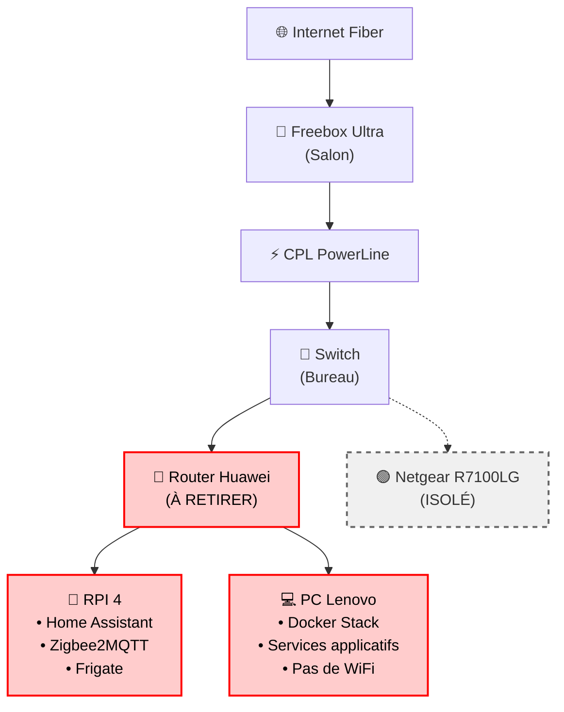
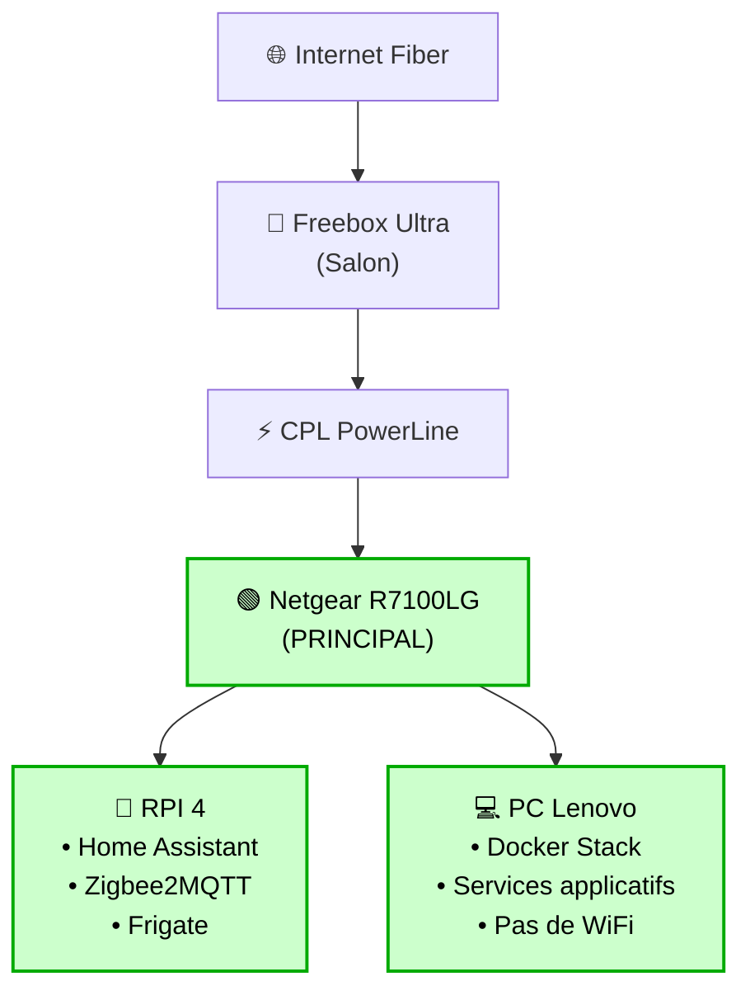
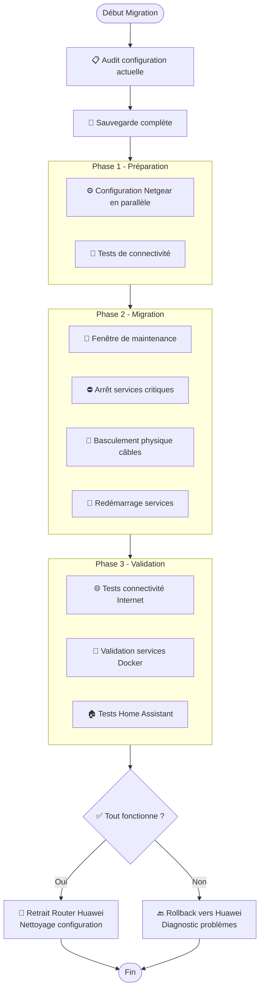
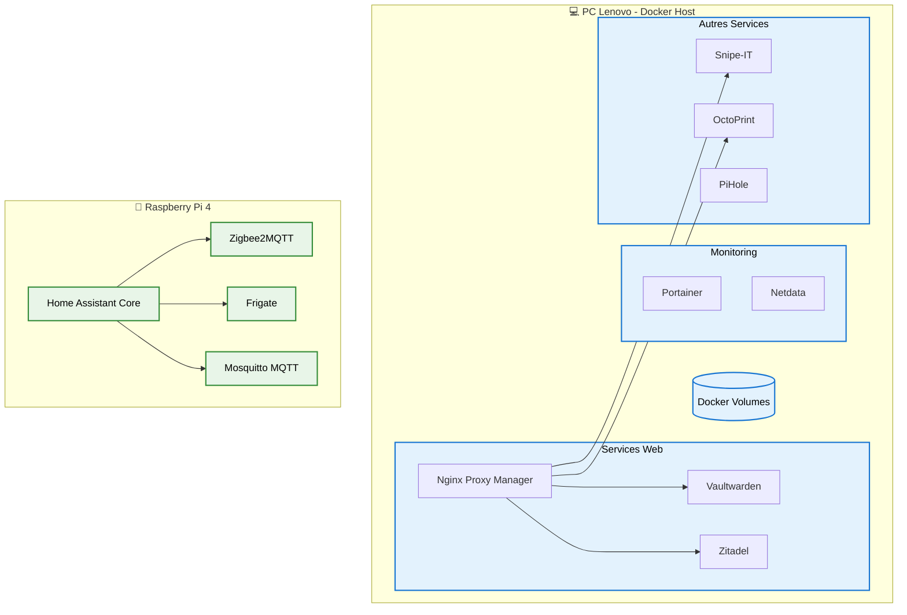

# Topologie Réseau

Cette page présente la topologie réseau actuelle et cible du home lab.

## Architecture Actuelle

```mermaid
graph TB
    Internet["🌐 Internet Fiber"]
    Freebox["📡 Freebox Ultra<br/>(Salon)"]
    CPL["⚡ CPL PowerLine"]
    Switch["🔀 Switch<br/>(Bureau)"]
    Huawei["🔴 Router Huawei<br/>(À RETIRER)"]
    Netgear["🟢 Netgear R7100LG<br/>(ISOLÉ)"]
    RPI["🍓 RPI 4<br/>• Home Assistant<br/>• Zigbee2MQTT<br/>• Frigate"]
    Lenovo["💻 PC Lenovo<br/>• Docker Stack<br/>• Services applicatifs<br/>• Pas de WiFi"]
    
    Internet --> Freebox
    Freebox --> CPL
    CPL --> Switch
    Switch --> Huawei
    Switch -.-> Netgear
    Huawei --> RPI
    Huawei --> Lenovo
    
    classDef current fill:#ffcccc,stroke:#ff0000,stroke-width:2px,color:#000
    classDef target fill:#ccffcc,stroke:#00aa00,stroke-width:2px,color:#000
    classDef isolated fill:#f0f0f0,stroke:#666,stroke-width:2px,stroke-dasharray: 5 5,color:#333
    
    class Huawei,RPI,Lenovo current
    class Netgear isolated
```

## Architecture Cible

```mermaid
graph TB
    Internet["🌐 Internet Fiber"]
    Freebox["📡 Freebox Ultra<br/>(Salon)"]
    CPL["⚡ CPL PowerLine"]
    Netgear["🟢 Netgear R7100LG<br/>(PRINCIPAL)"]
    RPI["🍓 RPI 4<br/>• Home Assistant<br/>• Zigbee2MQTT<br/>• Frigate"]
    Lenovo["💻 PC Lenovo<br/>• Docker Stack<br/>• Services applicatifs<br/>• Pas de WiFi"]
    
    Internet --> Freebox
    Freebox --> CPL
    CPL --> Netgear
    Netgear --> RPI
    Netgear --> Lenovo
    
    classDef target fill:#ccffcc,stroke:#00aa00,stroke-width:2px,color:#000
    class Netgear,RPI,Lenovo target
```

## Plan de Migration

```mermaid
flowchart TD
    Start([Début Migration])
    Audit[📋 Audit configuration actuelle]
    Backup[💾 Sauvegarde complète]
    
    subgraph Phase1[Phase 1 - Préparation]
        Config[⚙️ Configuration Netgear en parallèle]
        Test1[🧪 Tests de connectivité]
    end
    
    subgraph Phase2[Phase 2 - Migration]
        Maintenance[🚨 Fenêtre de maintenance]
        Stop[⛔ Arrêt services critiques]
        Switch[🔄 Basculement physique câbles]
        Restart[🚀 Redémarrage services]
    end
    
    subgraph Phase3[Phase 3 - Validation]
        TestNet[🌐 Tests connectivité Internet]
        TestDocker[🐳 Validation services Docker]
        TestHA[🏠 Tests Home Assistant]
    end
    
    Decision{✅ Tout fonctionne ?}
    Success[🎉 Retrait Router Huawei<br/>Nettoyage configuration]
    Rollback[🔙 Rollback vers Huawei<br/>Diagnostic problèmes]
    End([Fin])
    
    Start --> Audit
    Audit --> Backup
    Backup --> Phase1
    Phase1 --> Phase2
    Phase2 --> Phase3
    Phase3 --> Decision
    Decision -->|Oui| Success
    Decision -->|Non| Rollback
    Success --> End
    Rollback --> End
```

## Services par Machine

```mermaid
graph TB
    subgraph Lenovo[💻 PC Lenovo - Docker Host]
        subgraph Web[Services Web]
            NPM[Nginx Proxy Manager]
            Vault[Vaultwarden]
            Zitadel[Zitadel]
        end
        
        subgraph Monitor[Monitoring]
            Portainer[Portainer]
            Netdata[Netdata]
        end
        
        subgraph Others[Autres Services]
            Snipe[Snipe-IT]
            Octo[OctoPrint]
            PiHole[PiHole]
        end
        
        Volumes[(Docker Volumes)]
    end
    
    subgraph RPI[🍓 Raspberry Pi 4]
        HA[Home Assistant Core]
        Zigbee[Zigbee2MQTT]
        Frigate[Frigate]
        MQTT[Mosquitto MQTT]
    end
    
    NPM --> Vault
    NPM --> Zitadel
    NPM --> Snipe
    NPM --> Octo
    
    HA --> Zigbee
    HA --> Frigate
    HA --> MQTT
    
    classDef docker fill:#e3f2fd,stroke:#1976d2,stroke-width:2px,color:#000
    classDef ha fill:#e8f5e8,stroke:#388e3c,stroke-width:2px,color:#000
    
    class Web,Monitor,Others,Volumes docker
    class HA,Zigbee,Frigate,MQTT ha
```