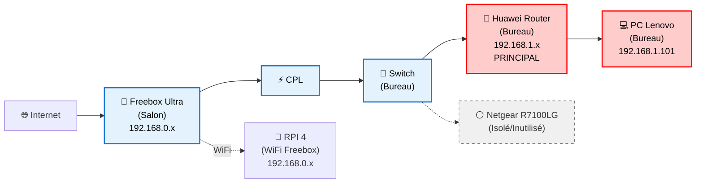
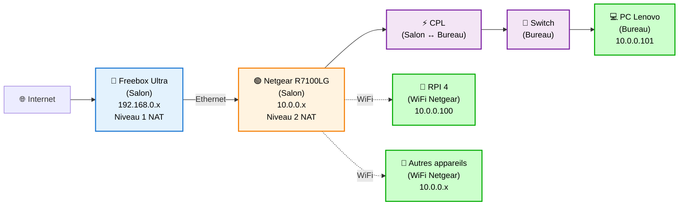
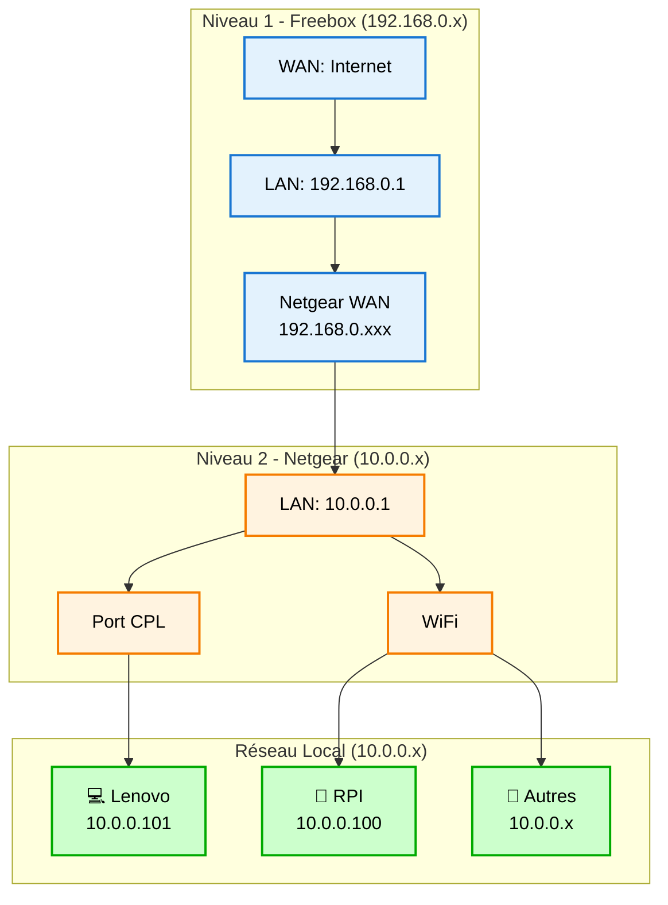

# Plan de Migration Réseau - Suppression Huawei

## Objectif
Remplacer complètement le router Huawei par le Netgear R7100LG comme routeur principal.

## Architecture Actuelle vs Cible

### Actuelle

### Cible - Architecture Double NAT

### Double NAT - Flux de données

## Changements Majeurs

### Réseau
- **Architecture**: Simple NAT → Double NAT (Freebox + Netgear)
- **Plage IP locale**: `192.168.1.x` → `10.0.0.x`
- **Routeur principal**: Huawei (bureau) → Netgear R7100LG (salon)
- **WiFi RPI**: Freebox WiFi → Netgear WiFi
- **Emplacement**: Netgear déplacé au salon (près Freebox)

### Services
- **Port forwarding double**: Internet → Freebox → Netgear → `10.0.0.101`
- **DNS PiHole**: `10.0.0.101` (nouvelle IP Lenovo)
- **Domaines locaux**: Tous pointent vers `10.0.0.101`
- **CPL**: Transport réseau `10.0.0.x` (bureau ↔ salon)

## Plan d'Exécution - Migration Double NAT

### Phase 1 - Installation Netgear (salon) - 0 downtime
1. **Installation physique Netgear**
   - Déplacement Netgear au salon
   - Connexion Ethernet: Freebox → Netgear (port WAN)
   - Alimentation Netgear

2. **Configuration Netgear R7100LG**
   - Connexion admin interface Netgear
   - Configuration WAN: DHCP (prendra IP Freebox 192.168.0.x)
   - Configuration LAN: 10.0.0.1/24
   - DHCP: 10.0.0.2-200
   - DNS: 10.0.0.101 (futur PiHole)
   - Configuration WiFi pour RPI

3. **Test connectivité Netgear**
   - Vérifier accès Internet depuis Netgear
   - Noter IP WAN attribuée par Freebox
   - Test WiFi fonctionnel

### Phase 2 - Migration réseau (downtime ~15-30min)
1. **Sauvegarde configuration actuelle**
   - Export config Huawei
   - Backup IPs et services
   - Exécution script pre-migration.sh

2. **Basculement physique CPL**
   - Déconnexion CPL du switch (bureau)
   - Connexion CPL au port LAN Netgear (salon)

3. **Reconfiguration machines**
   - PC Lenovo: 192.168.1.101 → 10.0.0.101
   - RPI 4: WiFi Freebox → WiFi Netgear + 10.0.0.100

### Phase 3 - Configuration Double NAT
1. **Port forwarding Freebox**
   - 80 → IP_WAN_Netgear:80
   - 443 → IP_WAN_Netgear:443

2. **Port forwarding Netgear**
   - 80 → 10.0.0.101:80 (PC Lenovo)
   - 443 → 10.0.0.101:443 (PC Lenovo)

3. **Tests services web**
   - Vérification accès externe
   - Tests domaines locaux

### Phase 4 - Validation et finalisation
1. **Exécution script validation**
   - Tests connectivité complète
   - Validation services Docker
   - Tests Home Assistant

2. **Retrait définitif Huawei**
   - Déconnexion physique
   - Nettoyage switch bureau
   - Stockage Huawei

3. **Documentation finale**
   - Mise à jour configurations
   - Backup nouvelle architecture

## Points d'Attention

### Risques Identifiés
- **Double NAT**: Peut compliquer certains services (P2P, gaming)
- **Port forwarding double**: Configuration plus complexe
- **CPL performance**: Transport réseau sur plus longue distance
- **WiFi RPI**: Double changement (réseau + IP)
- **Services Docker**: Vérifier aucune IP hardcodée

### Plans de Rollback
- **Rollback physique rapide**: Remettre CPL sur switch + Huawei
- **Sauvegarde complète** avant migration
- **Config Netgear**: Garde la configuration en cas de retour arrière
- **Scripts automatisés** de rollback

### Avantages Architecture Double NAT
✅ **Sécurité**: Isolation réseau local vs Freebox
✅ **Contrôle total**: Netgear gère le réseau local
✅ **Migration progressive**: Installation sans coupure
✅ **Administration centralisée**: Salon (Freebox + Netgear)

## Timeline Estimée
- **Phase 1 (Installation Netgear)**: 1-2h
- **Phase 2 (Migration)**: 30min downtime
- **Phase 3 (Double NAT)**: 30min
- **Phase 4 (Validation)**: 1h
- **Total**: ~4h avec rollback possible

## Validation Success Criteria
- [ ] Internet accessible depuis PC Lenovo et RPI
- [ ] Services web accessibles via `vault.example.local`
- [ ] Home Assistant fonctionnel
- [ ] DNS PiHole résout correctement
- [ ] Communication HA ↔ services Docker
- [ ] Performance réseau acceptable